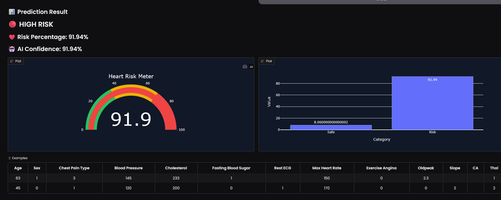
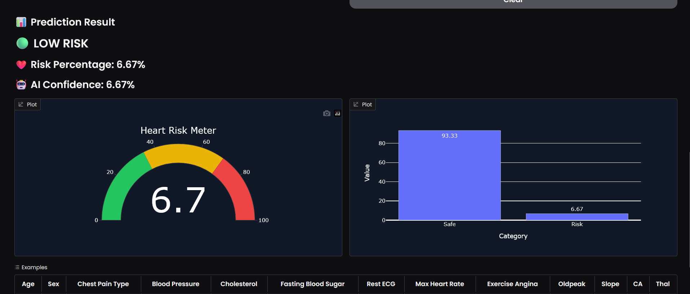
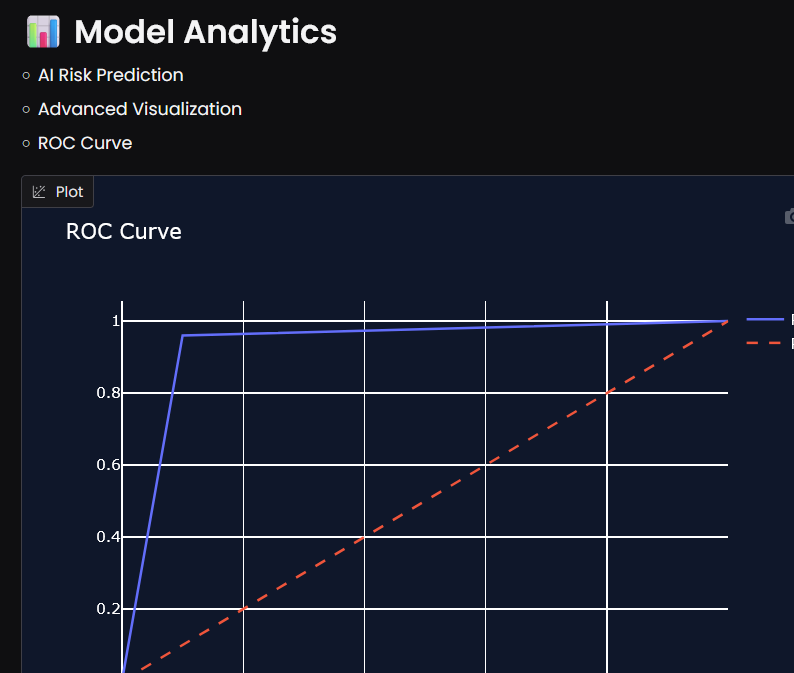

# 🫀 Heart Disease Prediction using Machine Learning
<p align="center">
  
  
  
 
</p>

A Machine Learning-based project that predicts the likelihood of heart disease using patient medical data. This system helps analyze health parameters and provides prediction results using trained ML and Deep Learning models.

---

# 🚀 Features

- Heart disease prediction using Machine Learning
- Data preprocessing and normalization
- Model training using PyTorch
- Real-time prediction support
- User-friendly implementation
- Model saving and loading functionality

---

# 🛠️ Technologies Used

- Python
- PyTorch
- Pandas
- NumPy
- Scikit-learn
- Matplotlib
- Jupyter Notebook / Kaggle Notebook

---

# 📊 Dataset

The project uses the Heart Disease dataset containing medical parameters such as:

- Age
- Sex
- Chest Pain Type
- Cholesterol
- Blood Pressure
- ECG Results
- Maximum Heart Rate
- Fasting Blood Sugar
- Exercise-Induced Angina

Dataset Sources:
- UCI Machine Learning Repository
- Kaggle Heart Disease Dataset

---

# ⚙️ Machine Learning Workflow

1. Data Collection
2. Data Cleaning
3. Feature Scaling
4. Train-Test Split
5. Model Training
6. Model Evaluation
7. Prediction

---

# 🧠 Model Used

The project uses a Neural Network built with PyTorch.

### Algorithms Explored
- Logistic Regression
- Random Forest
- Neural Networks (PyTorch)

---

# 📈 Accuracy

The trained model achieved approximately:

✅ 85% – 90% accuracy

depending on preprocessing and hyperparameter tuning.

---

# 📂 Project Structure

```bash
heart-disease-prediction/
│
├── heart.csv
├── train.py
├── app.py
├── heart_model.pkl
├── requirements.txt
└── README.md
